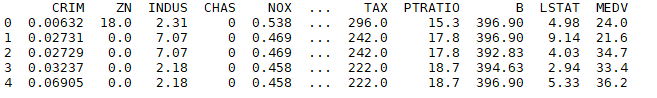
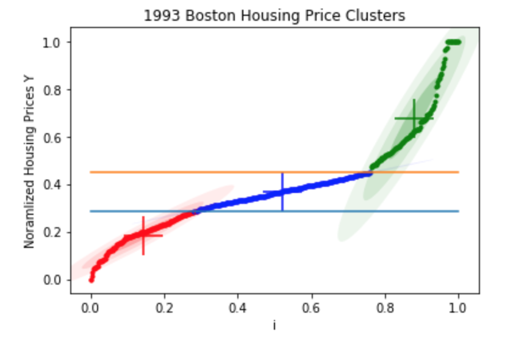

# Housing_Market

## 1 Abstract
Earlier this year, a challenge was presented on Kaggle, a popular machine- learning project site which challenges computer scientists with real-world prob- lems and datasets. The challenge poses the issue of attempting to predict hous- ing prices in Boston suburbs given a multitude of parameters. [1] [2] During the course of this semester the team explored Probabilistic Modeling techniques to classify and make/test predictions on the classified housing prices. Scikit Learn libraries were used as baselines to compared the teams techniques against.

Figure 1: Example UCI Housing Data

## 2 Problem Introduction
The team took its data from the UCI Boston Housing dataset [3], which is a collection of 506 instances consisting of 14 attributes regarding crime rates, year built, accessibility, pollution, property tax, etc. The goal is to classify the 506 homes into lower, middle, and upper tier labels based off the attributes of individual homes relative housing prices (MEDV) in the data set. Once the homes are classified into their respective tiers then the team used probabilistic learning algorithms discussed throughout the semesters to make predictions on the classified data to learn which parameters affect the classification of each member into their tiers.
This challenge problem was chosen because it represents an interesting dilemma because it is an open-ended dataset that can readily be applied upon with var- ious algorithms with ease, allowing the team to create a self-defined task to analyze the dataset. Therefore, it is a great resource to use learned machine learning techniques to test and analyze our algorithms on.

## 3 Algorithms
In order to be able to perform regression analysis on the data set the team first had to assign labels. The team used a Gaussian Mixture Model (GMM) with Expectation Maximization (EM) updates to determine these labels. GMM was chosen since as an unsupervised learning algorithm it wouldn’t require knowing tiers when deciding the assignment of a house.

Expectation Step:
$\begin{equation} 
y_{nk} = \frac{(\pi_k^{old} * N(X_n| \mu_k^{old}, \Sigma_k^{old}))}{\sum_{j}^{K} \pi_j^{old} N(X_n| \mu_j^{old}, \Sigma_j^{old} )} 
\end{equation}$

 where $y_{nk}$ is the probability of $X_n$ being generated by a component and $\pi$'s are the previous assumptions. 

 Maximization Step:  
$\begin{equation} 
    \pi^{new} = \frac{\sum_{i=1}^N y_{ik}}{N}
\end{equation}$

$\begin{equation} 
    \mu^{new} = \frac{\sum_{i=1}^N x_i y_{ik}}{\sum_{i=1}^N y_{ik}}
\end{equation}$ 

$\begin{equation}
    \Sigma^{new} = \frac{\sum_{i=1}^N y_{ik}(x_i - \mu_k)^2}{\sum_{i=1}^N y_{ik}}
\end{equation}$ 

After using GMM to define labels the team split the data up into training and testing chunks to perform logistic regression on. The first type of logistic regression applied was Logistic Regression with Newton Raphsen Updates where weights are obtained based off previous assumptions. 

$\begin{equation} 
    w^{new} = w^{old} - \left (I + \sum_{n=1}^N y_n(1-y_n)x_n x_n^T \right )^{-1} \left (w^{old} + \sum_{n=1}^N (y_n - t_n) x_n \right )
\end{equation}$ 

$w$ are the weights, $t_n$ are the labels, $I$ is identity matrix, $y_n = \sigma(w_n \cdot x_n^T)$ 

The team then used Variational Logistic Regression with EM style updates to see if they could achieve better accuracy and convergence rate. 

$\begin{equation}
    m_n = S_n\left (S_0^{-1} m_0 + \sum_{n=1}^N (t_N - 1/2) x_n \right )
\end{equation}$

$\begin{equation} 
    S_n^{-1} = S_0^{-1} + 2\sum_{n=1}^N \lambda x_n x_n^T
\end{equation}$ 

where 

$ \begin{equation} 
    \lambda = \frac{\sigma(x_n) - 1/2}{2 \cdot x_n}
\end{equation} $ 

## 4 Experimental Evaluations

Figure 2: Sorted Housing Price Clusters

Referring to Figure 2, these represent different tiers (clusters) of housing prices with their own respective centroid and variance. We can clearly see the middle tier (blue) is the most stable as the standard deviations from the centroid of the cluster are barely visible compared to the magnitude of the variances of the lower and upper clusters. And the approximate threshold for each cluster's normalized MEDV range as represented by the horizontal bars. This may be due to the larger number of members that were classified as middle tier (almost twice as many members as in lower or upper).

Figure 3: Test Data Accuracy Results For Logistic Regression Methods

Using these housing pricing classifications, we can use these memberships as labels for our logistic regression in order to determine how much each individual parameter impact housing tier membership. Referring to Figure 3, we can see the final accuracy results of running our logistic regression algorithms on our data with our custom labels derived from our GMM.

There is not much to distinguish here other than the variational method's lacking in accuracy in the middle tier case. However, the overall mean accuracy of all three methods are roughly the same. However, it's important to note that the team's implemented methods, on average, performed just as well as the Sklearn library's logistic regression.

However, accuracy is not the only result we should be looking at. Referring to Figures 4,5, we can see the rate of convergence between the team's implemented Raphsen-Newton Logistic Regression and Variational EM Logistic Regression. Here we can clearly see the superiority, in this test case, of a variational EM method over a more classical approach as we converge very rapidly with a clear 2nd order convergence rate. However in contrast, the Logistic Regression with Raphsen-Newton updates convergence rates are wildly deviating until converge, especially in the upper tier case. This is not at all like the variational method with a clear and smooth convergence.

## 5 Conclusions & Possible Extensions
Looking at the experimental evaluations, it's clear that the dataset has a lot of variance inherent that will cause a naturally low level of accuracy regardless of what method is chosen, even with the team's own methods or an implemented library. However, it's clear in our results that variational logistic regression with EM style updates is the most stable of the team's two methods and performs just as well as the Sklearn's version.

As for possible future work, the team considered other methods to normalize the data that might allow us to glean a higher accuracy or better convergence. Also, it might be worth considering using other machine learning algorithms such as neural-networks or other stochastic techniques.

## References

[1] Boston Housing Prices. Predict house prices in suburbs of Boston (2019, January). Retrieved September 30, 2019, from https://www.kaggle.com/c/gradient-boston-housing/overview

[2] House Prices: Advanced Regression Techniques (2019). Retrieved Septem-ber 30, 2019, from https://www.kaggle.com/c/house-prices-advanced-regression-techniques/overview

[3] Machine Learning Databases, Housing (2019).   https://archive.ics.uci.edu/ml/machine-learning-databases/housing/

[4] Bishop, C. (2006). Pattern recognition and machine learning. Springer Ver- lag.

[5] Scikit-Learn API Reference LogisticRegression https://scikit-learn.org/stable/modules/generated/sklearn.linear model.LogisticRegression

